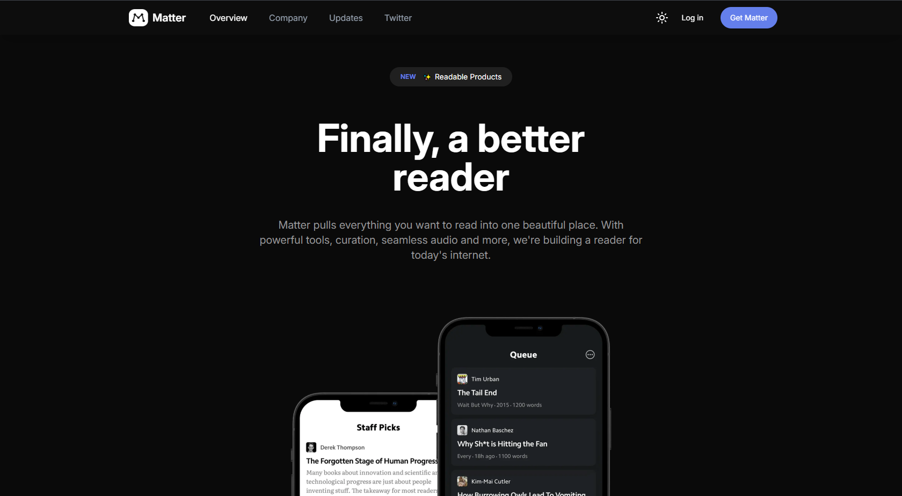

# 🎬 Matter App – Landing Page (UI Practice)

A modern, responsive landing page built with **React**, **Vite**, **Tailwind CSS**, and **Framer Motion**.  
This project was designed as a **personal UI and animation practice** to improve frontend workflow, component structure, and motion design skills.

---

## 🚀 Features

- ⚡ Built with **Vite + React** for fast development  
- 🎨 Styled using **Tailwind CSS** with a custom theme  
- 🌀 Smooth animations powered by **Framer Motion**  
- 🧱 Modular and reusable components  
- 🐱 API integration with [The Cat API](https://thecatapi.com/) and [DummyJSON](https://dummyjson.com/comments)  
- 💀 Custom **Skeleton Loaders** for async content  
- 🌗 Dark/Light mode friendly design

---

## 🛠️ Tech Stack

| Category | Tech |
|-----------|------|
| Framework | React (Vite) |
| Styling | Tailwind CSS |
| Animations | Framer Motion |
| Icons | Lucide React |
| HTTP | Axios |
| Hosting | Vercel |

---

## 📷 Preview



> *(Make sure you have a `preview.png` inside `/src/assets` or update the path if different)*

---

## 🔗 Live Demo

👉 [View on Vercel](https://matter-nine.vercel.app/)

---

## 🧠 Purpose

This project was built to:
- Practice **component-based design**
- Learn **Framer Motion animation patterns**
- Improve understanding of **layout composition and transitions**
- Develop smoother **UI/UX interactions**

---

## 💡 Future Improvements

-Add responsive navbar and theme toggle
-Improve accessibility
-Implement scroll-based animations
-Refine API integration with real movie data

---

## ⚙️ How to Run Locally

```bash
# Clone the repository
git clone https://github.com/AmirElahpour/movie-app.git

# Navigate into the project
cd movie-app

# Install dependencies
npm install

# Start the development server
npm run dev
گگگگگگ
گگ
